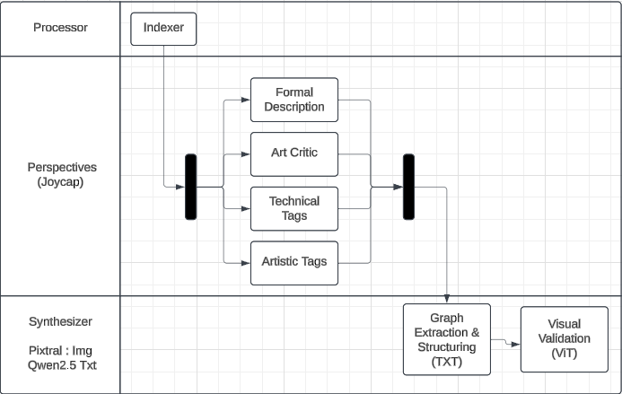

# graphcap
> **SPDX-License-Identifier: Apache-2.0**



**graphcap** is a work-in-progress repository dedicated to experimenting with **structured outputs** and **scene-based captions** to support open-source dataset generation. By leveraging models capable of producing detailed annotations (including bounding boxes, attributes, relationships, and textual captions), graphcap aims to streamline the creation of rich, shareable metadata for images.

## Key Ideas

- **Structured Image Captions**  
  Generates scene graphs (or detailed JSON-based annotations) to provide a more holistic description of image content.

- **Local or Remote Inference**  
  Designed for flexibility in how models are run (local GPU, cloud-based APIs, or hybrid approaches).

- **Open-Source Collaboration**  
  Focused on community-driven development and data generation, following open standards and licenses.

## Current Status

- **Experimental Code**: The repository is under active development, and many features or interfaces may change frequently.
- **Licensing**: The project is made available under the [Apache-2.0 License](https://www.apache.org/licenses/LICENSE-2.0), ensuring open collaboration and usage.

## Background
Original RFC : [link](https://github.com/Open-Model-Initiative/OMI-Data-Pipeline/issues/134)


## Deployment:

Codebase is under major refactor for initial version. Deployment is not yet stable.

On first run, you need to setup the docker network: 

```
docker network create gcap_network
docker compose up -d
```

To Stop:
```
docker compose down
```

To update environment configuration copy the docker compose override file and uncomment the services you want to modify with your desired configuration:

```
cp docker-compose.override.example.yml docker-compose.override.yml
cp provider.example.config.toml provider.config.toml
cp .env.caption.template .env.caption
```

## CLI

To run graphcap cli 


```python
# Pre req : set up .env and provider.config.toml
cd ./server
uv venv
uv sync
uv pip install -e . 
uv run python ./graphcap/main.py batch-caption ../datasets/os_img --provider gemini --output ../local/os_img/output.jsonl -c ../provider.config.toml
```

This should generate a jsonl file in the local directory of the root project.


